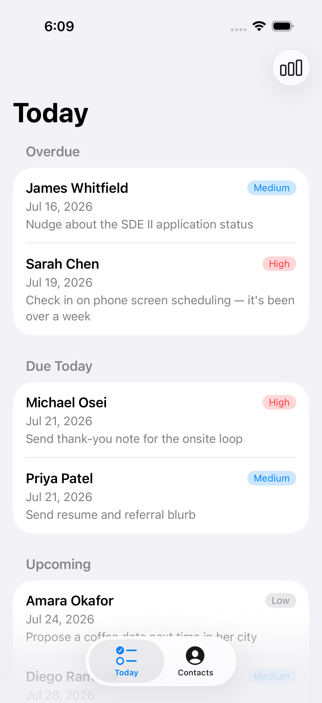
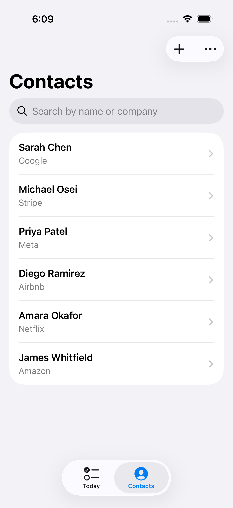
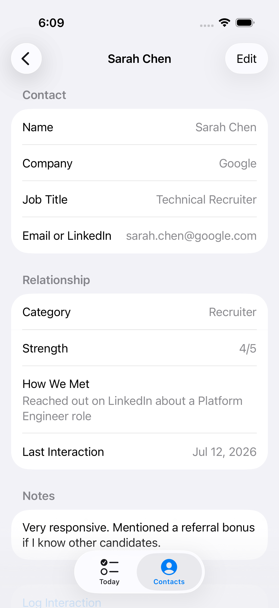
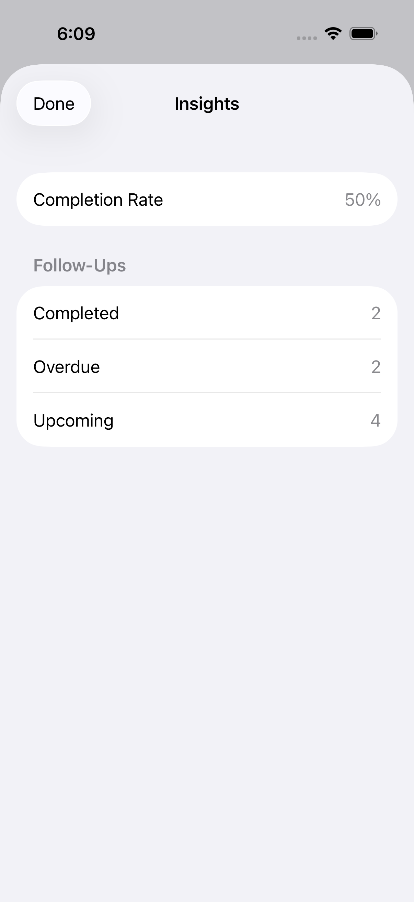
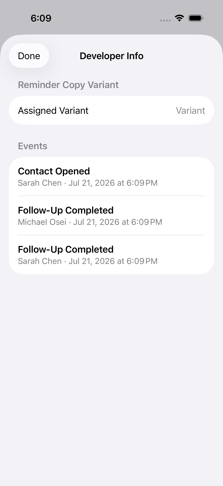

# NextStep

A native iOS app that helps job seekers keep track of the people in their network — who they've
talked to, what was said, and who needs a follow-up next.

<p align="center">
  
  
  
  
</p>

## What it does

- **Track contacts** — recruiters, referrals, alumni, hiring managers, peers — with relationship
  strength, how you met, and notes.
- **Log interactions** — every email, call, LinkedIn message, or interview, with outcomes and
  next-action notes, shown as a timeline on each contact.
- **Never lose a follow-up** — create a follow-up (optionally pre-filled from an interaction's
  next-action text), get a local reminder, and see everything that's overdue, due today, or
  upcoming on one screen.
- **See how you're doing** — a completion-rate summary and a home-screen widget showing your
  next few due follow-ups without opening the app.

## The technically interesting parts

This is a from-scratch, spec-driven build — every feature went through a written spec, an
implementation plan, and a task breakdown before any code was written (see
[`specs/`](specs/) and [`AI_USAGE.md`](AI_USAGE.md) for the full paper trail, including real bugs
found and fixed along the way). A few things worth a closer look:

**Protocol boundaries instead of concrete dependencies.** Every system-facing capability —
persistence (`ContactRepository`), local notifications (`NotificationScheduling`), analytics
(`AnalyticsTracking`), and experiment assignment (`ExperimentProviding`) — is a protocol with a
real implementation and, where it matters, a fake. That split exists for a concrete reason, not as
architecture theater: `UNUserNotificationCenter`'s permission dialog is a system-owned alert that
XCUITest cannot drive, so the app swaps in a `NoOpNotificationScheduler` under UI tests and never
depends on granting real permission to stay green in CI.

**A widget that reads the same live data as the app, safely.** The home-screen widget
([`NextStepWidget`](NextStepWidget/)) is a separate sandboxed process — it can't see the main
app's private SwiftData store at all. The store lives in a shared App Group container instead
(see [`SharedModelContainer`](NextStep/Core/Persistence/SharedModelContainer.swift)), and the
repository explicitly calls `WidgetCenter.reloadAllTimelines()` after any follow-up mutation so the
widget reflects an in-app change promptly instead of waiting on the system's passive refresh
budget. This was the one change in the whole project that touched already-working persistence
rather than adding new behavior, so it shipped with extra regression discipline — see the
Specification 5 entry in `AI_USAGE.md`.

**Deterministic experimentation, not random-per-launch.** `ExperimentProviding` assigns a
reminder-notification-copy variant once per install and persists it — every subsequent read
returns the same value, so the assignment is stable across launches instead of re-rolled. A hidden
developer screen (tucked into the Contacts tab's overflow menu, not a new nav item) lists every
tracked analytics event and the current variant, for verifying the instrumentation without
attaching a debugger.

**A notification-dismissal gap most implementations miss.** `UNUserNotificationCenterDelegate`
is not told when a user swipes away a notification by default — only a category registered with
`.customDismissAction` reports it. Caught during planning rather than discovered by a silent gap
in production.

## Screenshots

| Today | Contacts | Insights |
|---|---|---|
|  |  |  |

| Contact detail | Developer / analytics screen |
|---|---|
|  |  |

## Architecture

```text
NextStep/
├── App/                  # App entry point, root TabView, notification routing
├── Core/
│   ├── Models/            # SwiftData @Model types
│   ├── Persistence/        # ContactRepository protocol + SwiftData implementation
│   ├── Notifications/       # NotificationScheduling protocol + real/no-op implementations
│   ├── Analytics/           # AnalyticsTracking protocol + implementation
│   └── Experiments/         # ExperimentProviding protocol + implementation
├── Features/
│   ├── Contacts/           # List, detail, form
│   ├── Interactions/        # Timeline, form
│   ├── FollowUps/          # Today screen, follow-up form, due-date bucketing
│   └── Dashboard/          # Insights summary, hidden developer screen
NextStepWidget/            # WidgetKit extension (separate target)
NextStepTests/             # Swift Testing — pure logic, repository behavior
NextStepUITests/           # XCTest/XCUITest — full user flows
specs/                     # Spec Kit artifacts: spec → plan → tasks per feature
```

Each `Features/*` view talks only to the protocols in `Core/`, never to SwiftData or
`UNUserNotificationCenter` directly — this is what makes the fakes above possible and keeps view
models testable without a running app.

## Tech stack

Swift, SwiftUI, SwiftData, WidgetKit, UserNotifications, OSLog — no third-party dependencies, no
backend. Fully local-first: all data lives on-device (or in a shared App Group container for the
widget), and nothing is ever transmitted over the network.

## Getting started

```bash
brew install xcodegen  # if you don't have it
xcodegen generate
open NextStep.xcodeproj
# Select the "NextStep" scheme and an iOS 17+ simulator, then Run (Cmd+R)
```

The project file itself isn't committed — `xcodegen generate` builds it from `project.yml`, so run
that again after pulling changes that touch source file layout.

### Running the tests

```bash
xcodebuild test -project NextStep.xcodeproj -scheme NextStep \
  -destination 'platform=iOS Simulator,name=iPhone 17' \
  -only-testing:NextStepTests        # 65 unit tests (Swift Testing)

xcodebuild test -project NextStep.xcodeproj -scheme NextStep \
  -destination 'platform=iOS Simulator,name=iPhone 17' \
  -only-testing:NextStepUITests      # 44 UI tests (XCUITest)
```

CI runs the unit suite automatically on every push and pull request
([`.github/workflows/ci.yml`](.github/workflows/ci.yml)).

### Seeing it with sample data

Launch with `-SeedSampleData` (and `-UITestResetState` for an in-memory, disposable store) to
populate the app with realistic contacts, interactions, and follow-ups spanning every Today-screen
bucket — see [`SampleDataSeeder`](NextStep/App/SampleDataSeeder.swift).

## How this was built

Every feature followed the same cycle: `/speckit-specify` → `/speckit-plan` → `/speckit-tasks` →
implementation, via [GitHub Spec Kit](https://github.com/github/spec-kit) and Claude Code. Five
specifications shipped in order — core contact management, interactions, follow-ups &
notifications, experiments & analytics, and polish (icon, widget, CI) — each with its own spec,
plan, and task breakdown under [`specs/`](specs/), and each documented in
[`AI_USAGE.md`](AI_USAGE.md) including what was AI-assisted, what was manually reviewed, and every
real bug found along the way.
